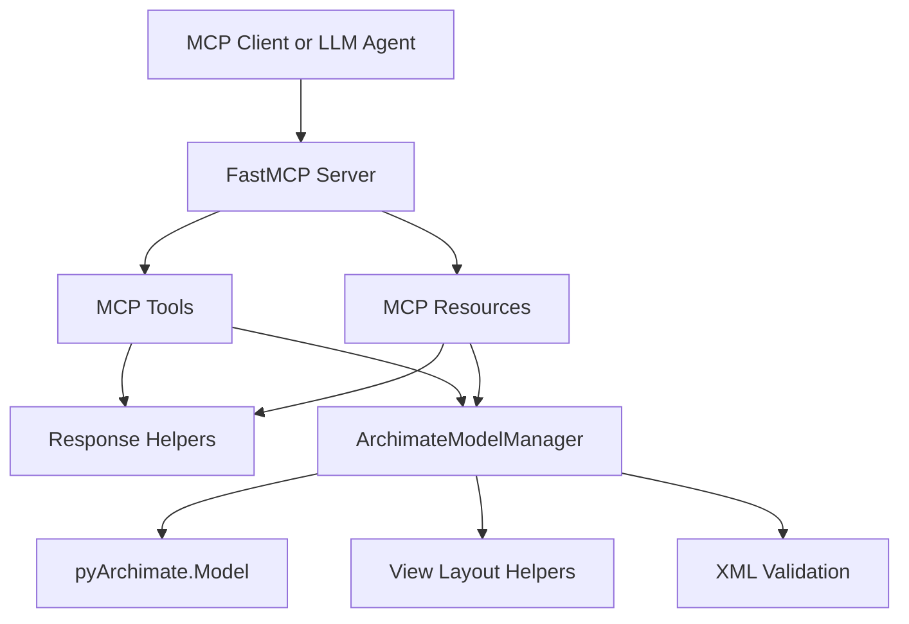

# Technical Architecture and Implementation Design

This document describes the current implementation of the ArchiMate MCP server. It is the reference for contributors; the client-facing tool documentation is `docs/USER_GUIDE.md`.

It absorbed the former `SDD.md` and `IMPLEMENTATION_PLAN.md` during the 0.7.0 open-source preparation. Those documents were a formal design spec and a milestone build plan for work completed long ago; both had drifted, and both restated tool and resource tables that `USER_GUIDE.md` maintains properly. The glossary below is the part of the SDD worth keeping. Design *rationale* now lives in the decision records under `.backlog/decisions/`, which this document links rather than duplicates.

## Architecture



The server is a single-process FastMCP application. It manages one active `pyArchimate.Model` instance per server process through `ArchimateModelManager`. Tool and resource modules register themselves by importing the shared `mcp` instance from `pyarchimate_mcp_server.mcp_app`.

## Core Components

`pyarchimate_mcp_server.mcp_app` owns FastMCP initialization and lifespan setup. During lifespan startup it creates a single `ArchimateModelManager` and exposes it through `AppContext`.

`pyarchimate_mcp_server.server` is the executable entrypoint. It makes the project root importable when the MCP CLI imports `server.py` as a standalone file, imports the shared `mcp` object from `mcp_app`, and imports tool/resource modules for decorator registration side effects.

`pyarchimate_mcp_server.model_manager` is the adapter boundary around `pyArchimate`. MCP modules do not call `pyArchimate` directly. The manager handles active model lifecycle, model metadata (name, documentation, properties), element CRUD, relationship CRUD, view CRUD, node, note and connection creation, batch/spec creation, query filters, XML import/export, file export, CSV export, folder path normalization, type normalization, semantic validation, XML security checks, detail mapping, and view layout.

`pyarchimate_mcp_server.constants` derives supported element and relationship types from pyArchimate's `ARCHI_CATEGORY` mapping at import time — the catalogues are never hardcoded, so they follow the installed version (63 element types and 11 relationship types on pyArchimate 1.12.0). Relationship inputs use pyArchimate relationship type names exactly, such as `Assignment`, `Serving`, and `Influence`.

`pyarchimate_mcp_server.models` contains Pydantic response shapes for element, relationship, view node, view connection, and view detail payloads.

`pyarchimate_mcp_server.responses` provides consistent tool/resource payload helpers. Success responses use `{"status": "success", "message": "...", "data": ...}`. Error responses use `{"status": "error", "message": "...", "error": {"code": "..."}}`.

## pyArchimate Usage

The implementation is pinned to the `pyArchimate~=1.12.0` API. The pin is deliberately a three-part `~=` (1.12.x only), unlike the `mcp` range: `layout.py` imports pyArchimate's *internal* layout surface (`ObstacleMap`, `Rectangle`, `RoutingConfig` from `pyArchimate.view.layout`), which carries no stability guarantee, so every minor bump earns an evaluation task rather than arriving silently.

The manager uses these API patterns:

- Create a model with `Model(name=..., desc=...)`. Model-level documentation is `Model.desc`, exposed as `documentation` on the read side; model properties use the same `entity.prop(key, value)` writer as every other concept.
- Create elements with `model.add(concept_type=element_type, name=..., desc=..., folder=...)`.
- Create views with `model.add(concept_type="View", name=...)`.
- Create a diagram-only note with `view.add(node_type="Label", label=text, x=..., y=..., w=..., h=..., uuid=...)` and attach annotation lines with `view.connect_note(note, target_node)`. Node kind is read from `node.cat`: `"Element"` for element-backed nodes, `"Container"` for Archi Groups (including the layer bands), `"Label"` for notes. `connect_note` creates a connection whose `ref` resolves to no relationship, which is what makes the annotation-connector exemption in `validate_model` necessary.
- Resolve a connection id back to its object through `model.conns_dict`.
- Create relationships with `model.add_relationship(rel_type=..., source=..., target=..., name=..., desc=..., access_type=..., influence_strength=...)`.
- Retrieve concepts through `model.elems_dict`, `model.rels_dict`, and `model.views_dict`.
- List concepts through `model.elements`, `model.relationships`, and `model.views`.
- Read properties from `entity.props` and write them through `entity.prop(key, value)`.
- Use `relationship.source` and `relationship.target` for relationship endpoints.
- Use `model.write()` with no path to return Open Group exchange XML string content.
- Use `model.write(writer=Writers.archi)` to return Archi native `.archimate` XML string content.
- Normalize Archi folder roots before export so user inputs such as `Business`, `/Business`, and `business` are stored as `/Business`.
- Export native `.archimate` from a copied model so pyArchimate's Junction writer compatibility adjustments do not mutate the active model.
- Stabilize generated native `.archimate` folder IDs during export so repeated exports of the same active model are diff-friendly.
- Post-process native `.archimate` Influence relationships so pyArchimate's `influenceStrength` metadata is written as Archi's native `strength` attribute.
- Retype annotation-only connectors in native `.archimate` exports. Archi has **two** diagram connection classes and picking the wrong one makes a view unopenable, so this is correctness, not cosmetics:
  - `archimate:Connection` is `DiagramModelArchimateConnection`, an `IDiagramModelArchimateComponent`. Archi calls `getArchimateConcept()` on it while building diagram figures.
  - `archimate:DiagramModelConnection` is the concept-less line Archi uses for note and group connectors.

  pyArchimate's `archiWriter` types *every* connection as `archimate:Connection` and merely omits `archimateRelationship` for annotation lines. Its code comment claiming Archi does the same is half right: Archi omits the attribute **and** writes the other type. The result is a concept-backed connection with no concept, so `getArchimateConcept()` returns null and Archi throws a `NullPointerException` while creating the editor part. The user sees **"Failed to create the part's controls"** and the entire view refuses to open — confirmed from an Archi 5.9 error log, where the only affected view in a 5-view model was the one holding the single connector lacking `archimateRelationship`. Nothing in `validate_model` or `validate_semantics` can catch this: the XML is well-formed, ids are unique, and no reference dangles. The repair in `_finalize_archi_output` keys on the **absence** of `archimateRelationship` rather than on any note/`Label` knowledge, so it repairs exactly the set Archi would mis-instantiate and leaves concept-backed connections alone. `test_archi_export_never_pairs_concept_connection_type_with_missing_relationship` asserts the invariant over every connection in an export.

  Note the asymmetry with the exchange format: there a view-only line is `Line`, here it is `archimate:DiagramModelConnection`. The two repairs are deliberately separate because the schemas are. One loss remains in the native format and predates this repair: pyArchimate's Archi *reader* discards a `sourceConnection` without an `archimateRelationship`, so an MCP archi export-then-reload keeps the note node but drops its connector line. Archi itself keeps both.
- Accept element types from pyArchimate 1.12.0's catalogue, including `ApplicationInteraction` and `BusinessInteraction`.
- Preserve relationship documentation and Influence relationship strength across XML import/export.
- Sanitize Open Group exchange (`archimate`) exports. `_sanitize_exchange_output` repairs two defects of the same class — an IDREF pointing at an identifier the document never declares — and both are still present in 1.12.0:
  - `_strip_dangling_view_properties`: the writer emits a `propertyDefinitionRef` for view-level properties without declaring the matching `propertyDefinition`. Confirmed on 1.12.0: a view carrying one property exports `propertyDefinitionRef="propid-1"` against zero declared definitions.
  - `_rewrite_note_connectors_as_lines`: the writer types *every* connection `xsi:type="Relationship"` and copies `c.ref` into `relationshipRef`. For a note line that `ref` is the synthetic id `view.connect_note` generated and never registered in `model.rels_dict`, so the export carries an unresolvable IDREF. `archimate3_Diagram.xsd` declares `relationshipRef` as `xs:IDREF use="required"` on `Relationship`, so the whole document fails keyref validation (`RelationshipRefAttribute`), Archi's validating import included. The schema's purpose-built type for a view-only connection is `Line`, which extends `ConnectionType`, keeps `source`/`target` and takes no `relationshipRef`; retyping is therefore lossless in the file. The rewrite is as narrow as the `_is_annotation_connector` validation exemption: a connector between two element-backed nodes whose relationship is genuinely missing stays a `Relationship` and stays reportable, because that is a model defect the export must not paper over.
- Expect the two writers to disagree about note connector lines. Native Archi export writes a note line as a `sourceConnection` with no `archimateRelationship` (what Archi itself writes), but pyArchimate's Archi *reader* returns early from `_parse_connection` for exactly that shape, so an `archi` export/import round trip through this server keeps the note node and drops its connector lines. The exchange reader likewise skips every `xsi:type="Line"` connection (`_read_view_connection` returns early with no `relationshipRef`), so `_restore_exchange_note_connectors` re-creates them after the load — identifier included, endpoints in file order so direction is preserved — which keeps the `archimate` round trip lossless. That restoration is as narrow as the write side: only a `Line` with a note endpoint is rebuilt, since a `Line` between two element nodes belongs to some other tool's drawing layer. This asymmetry is why the Open Exchange import test — not the native Archi one — is what proves the annotation-connector validation exemption.
- Use a temporary file for `model.read(path)` because this pyArchimate version reads from filesystem paths, not file-like objects.
- Never write to stdout anywhere in the server. The stdio transport uses stdout as the JSON-RPC channel, so a stray print corrupts framing and hangs clients. Use `logging`, which goes to stderr.

This avoids the unsupported calls that earlier scaffolding assumed, such as `model.add_element()`, `model.get_elem()`, `model.get_rel()`, `model.add_view()`, `model.elems`, `model.rels`, and `properties_list`.

## Relationship Rules and Quality Reporting

`pyarchimate_mcp_server.relationship_rules` wraps pyArchimate's `ALLOWED_RELATIONSHIPS` matrix (ArchiMate 3.2-compatible) behind deterministic helpers: `valid_relationship_types`, `compatibility`, intent-based `recommendations` (twelve intents such as `serves`, `reads_data`, `realizes`), `valid_alternatives` for invalid pairs, and `deterministic_repairs` for a small curated set of common modeling mistakes. `backend_metadata()` reports the installed pyArchimate version and rule source so responses never hardcode a version string.

The manager builds on those helpers:

- `add_relationship`/`add_relationships` accept `semantic_validation` (`off`/`warn`/`strict`). Strict mode raises `InvalidRelationshipCombinationError` with the valid alternatives in the exception's `details`.
- `build_quality_report` composes visual validation, semantic validation, and view coverage into one report; `export_model_content`/`export_model_to_file` accept `quality_gate` (`off`/`warn`/`strict`) which runs that report before serialization and blocks strict exports on failures. The file-export path reuses the gate's report (including its `warnings`) instead of computing it twice.
- `assess_togaf_readiness` is advisory only (`compliance_claim: false`) and is intentionally frozen in scope.

Error envelopes may carry a structured `error.details` object. `ArchiMateMCPError` stores a `details` dict that every tool handler forwards through `error_response`, so strict-validation failures deliver machine-readable repair options (`error.details.suggested_repairs`, `error.details.valid_alternatives`) and mistyped concept types deliver `error.details.suggestions` (did-you-mean candidates from the supported catalog).

Response models grew two agent-facing surfaces: `RelationshipDetail.is_directed` exposes Association directedness, and `ViewDetail` now includes `description`, `properties`, `metadata` (QA/coverage/stakeholder-facing flags derived from view properties), and `primary_viewpoint`.

## Tool Surface

Model tools:
- `create_empty_model(name, description=None, properties=None)` — `description` is written to `Model.desc` and read back as `documentation`
- `update_model(updates)` — writes `name`, `description` (alias `documentation`), and merged `properties` onto the active model, so metadata is editable on a *loaded* model and not only at creation. Annotated `IDEMPOTENT_TOOL`, unlike the destructive `create_empty_model`. Unknown keys are rejected with `INVALID_MODEL_UPDATE` (carrying `unsupported_keys` and `supported_keys` in `error.details`) rather than ignored the way `update_element` ignores them: a silently dropped model-metadata key would report success while writing nothing. Delegates to `ArchimateModelManager.update_model_metadata`, which raises `ModelNotFoundError` rather than returning a bool, because "no active model" is the only failure that shape has.
- `load_model_from_content(model_content, content_format="archimate")`
- `load_model_from_file(path, content_format="archi", *, inspect_after_load=True, include_semantic_validation=True, sample_limit=10)` — loads and (by default) inspects in one call
- `export_model_content(output_format="archimate", *, auto_layout=False, layout_strategy="layered_by_type", layout_engine="internal")` — `layout_engine` is `internal` or `pyarchimate`, and is validated even when `auto_layout` is false, where `archimate` emits Open Group exchange XML and `archi` emits Archi native `.archimate` XML. When `auto_layout` is true, all views are laid out before serialization.
- `export_model_to_file(path, output_format="archi", *, auto_layout=False, layout_strategy="layered_by_type", layout_engine="internal")` — same `layout_engine` values; nothing about the engine is written into the file
- `create_model_from_spec(spec, *, rollback_on_error=True)`
- `export_elements_to_csv()`
- `export_relationships_to_csv()`
- `validate_model()`, which delegates to pyArchimate's `check_invalid_conn()` and `check_invalid_nodes()` helpers, then filters annotation connectors out of the invalid-connection ids (see "Annotation connectors are exempt from visual validation" below). **Behaviour changed with pyArchimate 1.12.0.** On 1.11.3 `check_invalid_conn()` could only return `[]` or raise `KeyError` on the first orphan connection it met, so `validate_model()` could never actually report one. 1.12.0 returns the offending ids instead, so orphan connections now surface as `is_valid: false` with populated `invalid_connection_ids`. This propagates to `build_quality_report`, the `pyarchimate://activemodel/validation` resource, `inspect_active_model`, and the export quality gate — a model with orphan connectors that passed silently before can now block a `quality_gate="strict"` export.
- `validate_semantics()` — **additive to `validate_model()`, never a second opinion on the same defect.** The MCP owns no ArchiMate rules of its own; every hard-validity verdict comes from pyArchimate. Two consequences are load-bearing. First, dangling view nodes are deliberately *not* checked here: `check_invalid_nodes()` already reports them and is the stronger check (it also catches an `Element`-cat node with no `ref` at all), while `build_quality_report` places visual and semantic validation side by side, so the former `MISSING_NODE_ELEMENT` issue counted one dangling node twice. Second, the relationship loop *is* a deliberate duplicate of pyArchimate's `check_invalid_relationships()` and must not be collapsed into it: upstream calls `check_valid_relationship` without `raise_flg=True` and discards the reason string, returning bare relationship ids, whereas `_semantic_relationship_issue` passes `raise_flg=True` to capture `str(exc)` and enriches it through `relationship_issue_details` into an actionable issue carrying source/target names and types, `valid_alternatives`, `suggested_repairs` and `requires_decision` — which is what `repair_semantic_issues` and the did-you-mean `error.details` consume.
- `build_quality_report(*, include_togaf=False, include_quality_assurance_views=False)`
- `assess_togaf_readiness(*, include_quality_assurance_views=False, include_hard_validation=True)` — advisory only (`compliance_claim: false`)
- `list_supported_types()`
- `summarize_model()`, `summarize_view(view_id)`, `count_by_type()`, and `list_orphan_elements()`

Element tools:
- `add_element(element_type, name, description=None, folder_path=None, properties=None)`
- `add_elements(elements, *, rollback_on_error=True)`
- `update_element(element_id, updates)`
- `delete_element(element_id)`

Relationship tools:
- `add_relationship(relationship_type, source_id, target_id, name=None, description=None, properties=None, access_type=None, influence_strength=None)`
- `add_relationships(relationships, *, rollback_on_error=True)`
- `update_relationship(relationship_id, updates)`, where relationship updates can include `access_type` and `influence_strength`.
- `delete_relationship(relationship_id)`
- `get_relationship_compatibility(source_type, target_type)`
- `recommend_relationship(source_id=None, target_id=None, *, source_type=None, target_type=None, intent=None, strict_archimate=True)`
- `repair_semantic_issues(repair_ids=None, *, repair_all_deterministic=False, preserve_relationship_ids=True, rollback_on_error=True, update_views=True, auto_layout=False)`

View tools:
- `create_view(view_name)`
- `update_view(view_id, updates)`
- `delete_view(view_id)`
- `add_node_to_view(view_id, element_id, x=None, y=None, width=160, height=80)`
- `add_nodes_to_view(view_id, nodes, *, rollback_on_error=True)`
- `add_note_to_view(view_id, text, x, y, width=185, height=80, connect_to_node_ids=None, note_id=None)` — creates a `Label` node plus optional `connect_note` lines; `ADDITIVE_TOOL`, annotated identically to `add_node_to_view`. Coordinates bypass `_next_free_position` on purpose. `_resolve_note_connection_targets` resolves every target (visual node id *or* element id, via `_find_node_for_element`) **before** the note node is created, which is what makes the tool atomic without a deepcopy rollback: an unknown id raises `ModelOperationError` with `details.unknown_ids` while nothing has been written yet. Blank text is rejected twice — `INVALID_NOTE_TEXT` at the tool boundary, `ModelOperationError` at the manager boundary — so the manager stays safe when called directly, as the tests do.
- `add_connection_to_view(view_id, relationship_id)`
- `add_connections_to_view(view_id, connections, *, rollback_on_error=True)`
- `connect_visible_relationships(view_id, *, rollback_on_error=True)`
- `ensure_all_relationships_in_views(coverage_view_name="Relationship Coverage", *, auto_layout=True, layout_strategy="layered_by_type", layout_engine="internal", rollback_on_error=True)` — rejects any `layout_engine` but `internal`; the coverage layout is a fixed pair grid
- `auto_layout_view(view_id, strategy="layered_by_type", layout_engine="internal")` — `layout_engine` is `internal` (default) or `pyarchimate`; see "The two placement engines"
- `render_view_to_svg_file(view_id, path)` — delegates to `ArchimateModelManager.render_view_to_svg_file`, which calls pyArchimate's `View.to_svg(filepath)` (the adapter boundary holds, as always). Returns only `path` plus small metadata; the markup is never returned, and `"svg"` is deliberately absent from `SUPPORTED_FORMATS` so neither string-returning export path can emit it. The render is read-only: it triggers no layout pass and mutates nothing, so node coordinates and bendpoints are identical before and after. `show_stereotypes` is not exposed — it renders `concept.profile_name`, and this server models no profiles, so it would render nothing.

Query tools:
- `query_elements(filter_criteria)`
- `query_relationships(filter_criteria)`

Workflow tools (agent-facing):
- `get_usage_guide()`
- `inspect_active_model(*, include_semantic_validation=True, include_orphans=True, sample_limit=10)`

The registered surface is 45 tools, 6 resources, 3 resource templates, and 4 prompts. Every tool declares `ToolAnnotations` from the shared constants in `mcp_app.py`: 17 read-only, 10 additive, 10 idempotent, 8 destructive.

### Annotation connectors are exempt from visual validation

`Model.check_invalid_conn()` reports every connection whose `ref` does not resolve to a `Relationship`. That set includes the connector Archi draws from a Note to an element, which is purely visual and carries no ArchiMate semantics — so a model with a note line was reported invalid, and could be blocked by `quality_gate="strict"` on export. `ArchimateModelManager._is_annotation_connector` filters those ids out of `validate_model`, and therefore out of everything downstream of it: `build_quality_report`'s `visual_validation`, `inspect_active_model`, the `pyarchimate://activemodel/validation` resource, and the export quality gate.

The predicate is deliberately narrow, and each clause is load-bearing:

- An unresolvable `ref` alone is **not** enough. `layout.connection_relationship_type(connection) is not None` short-circuits first, so a real relationship connection is never examined further.
- Both endpoints must still exist. A connector whose `source` or `target` is `None` is a genuine defect and stays reported, even when the other end is a note.
- At least one endpoint must be `cat == "Label"`. A connector between two element-backed nodes whose relationship really is missing keeps being reported. `Container` endpoints (Archi Groups, including the layer bands) are deliberately **not** exempted — only Notes are.

The filter applies to the ids `check_invalid_conn()` returns, not to what pyArchimate logs on the way: each note connector still produces an `Orphan connection <id> to unknown relationship <ref>` line. That goes through `logging` to stderr, so it never touches the stdio JSON-RPC channel, but it does mean the log is noisier than the validation result.

## Resource Surface

Resources expose active model state:

- `pyarchimate://activemodel/info`
- `pyarchimate://activemodel/content`
- `pyarchimate://activemodel/validation`
- `pyarchimate://activemodel/elements`
- `pyarchimate://activemodel/elements/{element_id}`
- `pyarchimate://activemodel/relationships`
- `pyarchimate://activemodel/relationships/{relationship_id}`
- `pyarchimate://activemodel/views`
- `pyarchimate://activemodel/views/{view_id}`

## Layout Design

The detailed improvement roadmap for readable ArchiMate diagrams is maintained in [LAYOUT_IMPROVEMENT_PLAN.md](LAYOUT_IMPROVEMENT_PLAN.md). That document records the sample model metrics, design principles, adoption phases, and external layout engine evaluation so future implementation sessions can resume without losing context.

The layout implementation addresses generated diagrams where nodes are created with missing or repeated coordinates.

`add_node_to_view` accepts optional `x` and `y`. When coordinates are missing, or when the requested rectangle overlaps existing nodes, the manager places the node in the next free grid slot. Default node dimensions are `160 x 80`.

`auto_layout_view` repositions all existing nodes in a view. Supported strategies are:

- `layered_by_type`: places nodes into ArchiMate-specific horizontal lanes. The lane order keeps Motivation and Strategy above Business, Business above Application, Application data below application behavior/services, and Technology, Physical, and Implementation below that.
- `layered`: computes simple ranks from relationship direction so source nodes appear before target nodes.
- `grid`: places nodes in a compact non-overlapping grid without using relationship or type information.

Before placing nodes, the layout normalizes visual sizes such as compact junction symbols, nests Aggregation and Composition members under visible Grouping nodes, and creates missing group member nodes when the group is present in the view. It then estimates relationship label dimensions and expands row or column spacing when needed.

The router is density-aware. Small and moderate views can receive bendpoints when doing so reduces relationship label overlap with nodes or other labels. Dense views simplify routing and remove bendpoints because excessive detours create unreadable horizontal bands in Archi. Dense views also apply a label and emphasis policy: primary `Triggering` and `Flow` relationships keep labels when present, dense motivation/strategy views keep `Influence` labels, secondary labels are hidden through Archi's `nameVisible=false` connection feature, and secondary lines are light gray unless they already have a custom line color. For semantic lane layouts, `Access` relationships align `BusinessObject` and `DataObject` nodes under the behavior or service rank that reads or writes them. Group containment moves members inside the group for generated layouts. For meaningful authored layouts, it keeps the original top-level member placement and adds a contained duplicate inside the group panel. Group containment connections in readable views are label-hidden and light gray when the child is visually nested inside the group; `ensure_all_relationships_in_views` relocates those redundant connectors into the coverage view so validation coverage is preserved without drawing the same meaning twice in the readable view.

Diagram notes take a deliberately different path through that pipeline than element nodes, and `layout.py` classifies nodes by `node.cat` to do it:

- **Pinned, by two different mechanisms.** A note annotates one specific thing on the diagram, so relocating it destroys its meaning. The `internal` branch is handed `layout.placeable_nodes(view.nodes)`, which drops `Label` nodes so they are never placed at all. Upstream `auto_layout` accepts no such filter and *does* assign notes grid cells, so `auto_layout_view` snapshots every note with `layout.note_positions(view)` before the engine branch and calls `layout.restore_note_positions(...)` after it, discarding whatever upstream chose. The snapshot/restore pair sits outside the branch on purpose: it is the only thing making the two engines agree, and dropping the restore call silently reduces `pyarchimate` to unpinned notes. Restore runs *before* the routing epilogue so the obstacle map sees notes where they will actually be drawn. Nothing moves element nodes out from under a note, which is why the tool documentation tells callers to place notes in free space.
- **Snapshotted at a specific point in the prologue.** The capture sits *after* the last reparenting step (`nest_grouped_nodes`), so a nested note's parent is final, and *before* the first placement step (`layout_group_children_for_view`), so the pinned value is the caller's coordinate rather than one a prologue pass already overwrote.
- **Pinned relative to a parent when nested.** A top-level note — the only kind `add_note_to_view` can create — is pinned in absolute view coordinates. A note nested inside another node, which only arrives by importing an Archi file where a user dropped a Note into a Group or Grouping, is pinned as an offset from that parent and re-anchored to the parent's *final* position. Node coordinates are absolute in memory, but Archi clips a child to its parent's rectangle, so holding a nested note absolutely while placement moved its group away would render the note invisible. If the recorded parent is no longer the note's parent at restore time the offset is meaningless and the note is left alone rather than thrown to a coordinate derived from a stale anchor.
- **Excluded from group child layout.** `layout_group_children` lane-places `placeable_nodes(group_node.nodes)` and sizes the group from that same list, so a nested note is neither moved nor measured. Measuring it would size the group against coordinates `restore_note_positions` is about to overwrite.
- **Excluded from the coverage layout.** `ensure_all_relationships_in_views` never calls `auto_layout_view`, so it has no pin/restore around it. `_layout_coverage_view_pairs` therefore filters annotation connectors out of its pair enumeration and skips notes in its trailing reposition loop. Unfiltered, a note line is laid out as a relationship pair: the note is hard-assigned into the source column, the element it annotates into the target column, and every real relationship row is pushed down one 140px slot.
- **Not banded.** `add_layer_bands` only collects `cat == "Element"` nodes as band members, so a note is never wrapped by a band and stays a top-level node.
- **Routed around.** `route_connections_around_nodes` builds its `ObstacleMap` from `ROUTING_OBSTACLE_NODE_CATEGORIES = {"Element", "Label"}`; the condition used to be a bare `cat == "Element"`, which lumped notes in with layer bands. The distinction is that a band is decoration that must not deflect a route, while a note is ink on the diagram: a line drawn through a note is as unreadable as a line drawn through an element.
- **Not counted by the upstream suitability guard.** `oversized_nodes_for_pyarchimate` skips notes — but not because upstream leaves them alone. Upstream places them and `restore_note_positions` then throws that placement away, so a note never occupies the cell upstream chose; and since `assign_grid_cells` never reads `w`/`h`, an oversized note cannot displace another node either. Refusing the layout over a wide note would therefore be a false refusal naming the one node whose upstream placement is guaranteed to be discarded. A pinned note may still visually overlap a placed element, but that is the caller's chosen coordinate, not a collision this guard exists to catch.

Layout lives in `pyarchimate_mcp_server.layout` (module-level functions; the manager delegates). The default `layout_engine="internal"` understands ArchiMate lanes, group containment, label policy, and coverage-view rules. An explicit `auto_layout_view` call always lays the view out; group members are nested exactly once inside their `Grouping` node (legacy duplicate copies from older releases are healed automatically, with connections re-pointed to the surviving grouped node) and groups are sized to their members before lane placement so lanes never overlap grown groups. Connection routing keeps the MCP's anchor computation but delegates the orthogonal corridor search to pyArchimate's `ObstacleMap` A*. The former optional Graphviz adapter was removed.

#### Collinear segment separation

`route_connections_around_nodes` computes every route first (`route_single_connection` returns waypoints instead of writing them), runs `separate_collinear_connection_segments`, and only then writes bendpoints — pulling connections out of a shared corridor needs all routes in hand. The spreading itself is pyArchimate's `displace_collinear_segments`; the MCP contribution is the two guards it lacks, without which adopting it is a net regression (measured: it halves overlapping ink but doubles diagonal node-exit stubs and pushes segments into nodes). Details and the measured before/after are in [LAYOUT_IMPROVEMENT_PLAN.md](LAYOUT_IMPROVEMENT_PLAN.md); the implementation rules that must survive refactoring:

- Work in **offsets**, not in displaced points. `collinear_displacement_offsets` recovers each segment's own displacement by diffing upstream's output — a horizontal segment can only move in y, a vertical one in x, and a neighbour's displacement only moves the *other* coordinate of the waypoint they share. That is what lets one displacement be rejected without disturbing the rest of the polyline.
- **Anchor guard.** The first and last waypoints are the node anchors on the node centerline, so an offset touching them survives only when it moves along that anchor's own stub axis and leaves it at least `RoutingConfig.node_clearance` outside the node. Pinning the endpoints instead is simpler and was measured to throw away ~87% of the benefit.
- **Obstacle guard.** Offences are tagged per criterion (`"blocked"` vs `"interior"`) and compared to a baseline. Merging them into one set silently masks the common case: a segment already inside a node's 25 px clearance zone that a displacement newly drives through the node's interior.
- A final invariant reverts any polyline whose sequence of segment axes changed, so a route can never come out less orthogonal than it went in.

### The two placement engines

`layout_engine` selects **node placement** for a single call, and nothing else. It is never persisted — not on the model, not as a view property — so it cannot reach an export or Archi's Properties tab.

`ArchimateModelManager.auto_layout_view` is structured as prologue / branch / epilogue:

1. **Shared prologue** (both engines): `remove_layer_bands`, `normalize_view_node_sizes`, `nest_grouped_nodes` (with `remove_redundant_ungrouped_member_nodes` healing), `layout_group_children_for_view`, `apply_relationship_label_policy`, `apply_group_containment_connection_policy`. Every step is correctness or repair, so branching any of it away would regress the model — omitting the nesting healer in particular would make the ARC-017 duplication bug look like it had returned. Removing bands first is additionally required for the upstream engine: bands are top-level `Container` nodes far wider than a grid cell.
2. **Suitability guard** (`pyarchimate` only), before any placement write.
3. **Placement branch**: `internal` runs the existing gap computation and strategy dispatch, re-pins group children, and optionally adds layer bands; `pyarchimate` calls `layout.layout_nodes_pyarchimate` and re-pins group children, with no layer bands.
4. **Shared epilogue** (both engines): `_route_or_simplify_connections`, then `map_view_to_detail`. Routing consumes only final node geometry (`node.x/y/w/h`, `node.cat`) and connection endpoints — no rank maps, no barycenters, no lane indices — which is exactly why an alternative placement engine composes with it unchanged.

`layout.layout_nodes_pyarchimate` calls upstream `auto_layout(view, LayoutConfig())`, which is itself only `assign_grid_cells` + `apply_node_positions` — it writes `node.x`/`node.y` and nothing else, never creating, deleting or reparenting nodes, and never touching connection waypoints (`connections_processed` is a hardcoded `0`). It lives in `layout.py` rather than `model_manager.py` because `layout.py` already imports pyArchimate's internal layout surface; `layout.py` still never imports `model_manager`.

Three upstream behaviours the implementation has to work around:

- **It swallows every exception.** `auto_layout` catches everything and returns `LayoutResult(success=False, error_message=...)`; it never raises. An unchecked wrapper would hand back an unlaid-out view inside a success envelope, so `layout_nodes_pyarchimate` checks `result.success` and raises, and the manager converts that to `ModelOperationError`.
- **It has no collision detection.** `assign_grid_cells` never reads node `w`/`h`. Cells are unique and adjacent cells are exactly `grid_size` apart, so two nodes overlap *if and only if* some node exceeds `grid_size` in width or height — an exact condition, not a heuristic, and therefore checkable up front. `_require_pyarchimate_layout_is_safe` computes each top-level node's **subtree** bounding box (an imported Archi view can contain a child protruding past its parent, which would pass a bare `node.w`/`node.h` check and then collide with the parent's siblings) and refuses with `error.details.grid_size` and `error.details.oversized_nodes`. The threshold comes from `LayoutConfig().grid_size` at call time and must never be hardcoded — upstream's own `auto_layout` docstring claims `grid_size=120` while the dataclass says `240.0`. Overlaps are not merely ugly: a routing anchor landing inside a neighbour makes `find_corridor` fail and silently degrades every connection to a dogleg, so the guard is what keeps routing working too.
- **It preserves waypoints byte-for-byte.** That is helpful within `auto_layout_view`, where placement always precedes routing and routing clears bendpoints first. It is a trap anywhere else: running upstream `auto_layout` *after* a routing pass strands the surviving waypoints in empty canvas. Never call it outside this pipeline.

Layer bands are deliberately not re-applied after upstream placement. Upstream groups nodes into four priority buckets by substring matching, which disagrees with `layer_band_label_for_node`'s six-row ArchiMate classification, so band members end up non-contiguous and the band rectangles interleave; `add_layer_bands` also reparents nodes through `node.move(band)`, making the damage structural rather than cosmetic.

`ensure_all_relationships_in_views` rejects any engine but `internal`. Its coverage layout is `_layout_coverage_view_pairs`, a fixed source/target pair grid, and coverage views are separately excluded from bands and obstacle routing — so accepting an engine there would advertise a choice it structurally cannot honour.

Because being classified as the coverage view changes a view's treatment that much, `layout.is_coverage_view` keys on evidence, not on wording: the `mcp:relationship_coverage_view` marker that `_mark_coverage_view` writes on every view the MCP creates or adopts, or an **exact** match against the caller's `coverage_view_name`. The `"coverage" in name.lower()` substring fallback that used to follow those two was removed — it captured authored views ("Data Coverage Analysis", "Coverage of Payments"), which then silently skipped `add_layer_bands`, kept the redundant group-containment connectors that `_relocate_group_containment_connections_to_coverage` was meant to move, and were treated as generated scaffolding, with none of it reported to the caller. The marker survives a native `archi` round trip; it does not survive an exchange one, since `_strip_dangling_view_properties` drops every view property from `archimate` output, so after an exchange reload recognition depends on the caller passing `coverage_view_name` again.

#### Measured: how the two engines actually compose

Re-measured through the shipped tool path (`auto_layout_view`), not by calling upstream directly. Calling upstream in isolation is what produced the earlier "~200x faster" figure, and it does not describe what a caller experiences.

- **Routing composes cleanly, and that is the load-bearing property.** The epilogue consumes only final node geometry, so swapping the placement engine changes nothing about how routing behaves. Confirmed under `pyarchimate`: connections are still routed (30 of 42 on a 43-node view), and the geometry the router reads is whatever the branch produced.
- **End-to-end speed is a property of the view, not of the engine.** Placement alone: 0.073 ms (`pyarchimate`) vs 0.264 ms (`internal`) on 43 nodes, a 3.6x edge. End to end, medians of 9 runs after warmup, on Grouping-free Association chains:

  | Nodes / connections | `internal` | `pyarchimate` | Routed under each |
  | --- | --- | --- | --- |
  | 43 / 42 | 50.7 ms | 157.9 ms (3.1x **slower**) | 25 vs 30 of 42 |
  | 120 / 119 | 2.3 ms | 0.8 ms (3.0x faster) | 0 vs 0 |
  | 200 / 199 | 5.3 ms | 1.3 ms (4.2x faster) | 0 vs 0 |

  Below `should_simplify_connection_routing`'s gate the router does real work, and the airier upstream placement gives it *more* of it — more connections routed over longer corridors — which swamps the placement saving. Past the gate every bendpoint is stripped, routing is nearly free, and the placement difference is all that is left. Any future performance claim must say which side of that gate it was measured on.
- **Compactness is shape-dependent, not a fixed ratio.** On the 43-node view `internal` is tighter (3.24 vs 3.76 Mpx, 17.0% vs 14.6% ink), but on a 200-node chain `pyarchimate` is the more compact of the two (11.8 vs 21.4 Mpx) because lane wrapping stacks rows that the plain grid spreads across columns.
- **A refusal is not a no-op on every view.** The guard precedes the placement write but *follows* the shared prologue. On a flat view a refusal changes nothing; on a view with three loose `Composition` members the prologue had already nested them and grown the `Grouping` from 160x80 to 720x180 before the guard fired. The prologue is idempotent, so an immediately repeated call changes nothing further. The existing regression test asserts the untouched case on a flat view — do not generalize it in the docs to "a refusal never modifies the view".
- **Upstream's layer classifier, audited against this repo's catalogue.** All 63 element types fall into just four buckets (priorities 0/1/2/6). The catch-all bucket 6 holds 31 types including `Artifact`, `Contract`, `Equipment`, `Facility`, `Material`, `Path`, `Representation` and `SystemSoftware`, and `ImplementationEvent` lands in the Business bucket because `"event"` substring-matches. That is the concrete basis for the nine misplaced types named in the user guide.

### Why layout.py computes its own routing anchors

pyArchimate's own `auto_route()` wrapper is not used, and **the defect that forces this is still present in 1.12.0** — re-measured against the installed 1.12.0, not carried over from the 1.11.x note it replaces.

The cause is an arithmetic mismatch inside pyArchimate itself:

- `RoutingConfig.node_clearance` is `25`, and `ObstacleMap` inflates every node rectangle by that clearance.
- `_spread_positions` in `pyArchimate/view/layout/__init__.py` anchors each path at a hardcoded `_out = 13.0` px outside the node edge — well inside the 25 px zone the map just marked blocked.

Probing the map directly on a 120x55 node confirms the overlap: `is_blocked` is `True` at +5, +13, and +26 px past the node edge, and only goes `False` from about +30 px. Every corridor search therefore starts on a blocked cell. On a three-node, three-connection view, `auto_route()` returns `success=True` with `connections_processed=3` but routes **0 of 3**, warning `no valid orthogonal path found; existing waypoints preserved` for each, and adds no bendpoints.

`layout.route_connections_around_nodes` builds the same `ObstacleMap` but places anchors at `config.node_clearance + resolution` (35 px at the 10 px resolution), which clears the inflated zone and lets the search succeed. This custom anchoring is load-bearing for the 1.x line: there is no upstream replacement to migrate to, so it must not be removed as "duplicated upstream logic".

## Security Design

`load_model_from_content` accepts XML string content only. `load_model_from_file` is the explicit filesystem import path for local `.archimate` or XML files and reports missing or unreadable files with actionable error codes.

Before handing XML to pyArchimate, the manager:

- Enforces a 10 MB content size limit.
- Rejects `DOCTYPE` and `ENTITY` declarations.
- Parses with `lxml.etree.XMLParser(resolve_entities=False, no_network=True, recover=False, huge_tree=False)`.
- Rejects unsupported XML root elements.

After validation, the manager writes the string to a temporary `.archimate` file and calls `Model.read(path)` because pyArchimate 1.12.0 requires a path.

## Data Mapping

The manager maps pyArchimate objects into Pydantic details:

- `ElementDetail`: ID, name, type, description, properties, folder, incoming relationship IDs, outgoing relationship IDs.
- `RelationshipDetail`: ID, name, type, description, properties, access type, influence strength, source element ID, target element ID.
- `ViewDetail`: ID, name, nodes, and connections.
- `ViewNode`: visual node ID, element ID, element name, element type, optional parent node ID for nested/grouped nodes, `note_text`, x, y, width, and height. `note_text` carries `node.label` for `Label`-cat nodes and is `None` for everything else; without it a note would read back as an anonymous node with no element and no text, indistinguishable from a layer band.
- `ViewConnection`: visual connection ID, relationship ID, relationship type, source node ID, and target node ID.

## Testing and Quality Gates

Current verification commands:

```bash
uv run pytest
uv run ruff check
uv run ruff format --check
```

The suite is 167 tests across seven files. The manager tests cover model lifecycle, model metadata updates (including that a rejected update writes nothing at all) and their round trip through both export formats, element CRUD, relationship CRUD, relationship metadata, model validation, a dangling view node being reported exactly once across a quality report, coverage-view recognition by marker or exact name (with authored "…Coverage…" views still banded and still relocated), the annotation-connector exemption (including the connectors it must keep reporting), diagram notes — pinning under both engines, nested notes pinned to their group, the coverage layout leaving notes alone, and the exchange export declaring every IDREF it references — folder normalization, file export, stable native folder IDs, transactional batch rollback, spec-based model creation, supported type reporting, view node and connection creation, automatic placement, layout strategies, both layout engines and the pyArchimate suitability guard, collinear segment separation, XML round trip, XML entity rejection, CSV export, and no-active-model errors.

MCP-level registration is covered by `tests/test_mcp_discoverability.py`, which drives `mcp.list_tools()` against the real registered surface to assert that tools are served and that annotations match their peers. Tool-level tests (`test_model_tools.py`, `test_view_tools.py`, `test_workflow_tools.py`) and the resource test (`test_model_resources.py`) call the async tool/resource functions directly with `asyncio.run(...)` and monkeypatch each module's `_model_manager` helper, asserting on the response envelope.

## Appendix: Glossary

Salvaged from the retired `SDD.md`.

| Term | Meaning |
| --- | --- |
| **MCP** | Model Context Protocol. An open protocol for applications to provide context to LLMs. |
| **FastMCP** | The high-level server class in the `mcp` library that this server is built on. |
| **Tool** (MCP) | A function an LLM can call to perform an action or cause a side effect. |
| **Resource** (MCP) | A read-only data source addressed by URI. Here: `pyarchimate://activemodel/...`. |
| **Prompt** (MCP) | A reusable, parameterised workflow template offered to the client. |
| **ArchiMate** | An open enterprise architecture modelling language, governed by The Open Group. |
| **pyArchimate** | The Python library that does the actual ArchiMate work. See `NOTICE`. |
| **Element** | An ArchiMate concept — a Business Actor, an Application Component, and so on. |
| **Relationship** | An ArchiMate concept connecting elements, e.g. Composition, Serving, Assignment. |
| **View** (diagram) | A visual representation of a subset of the model, containing nodes and connections. |
| **Node** | The visual representation of an element within a view. Not the element itself. |
| **Connection** | The visual representation of a relationship within a view. |
| **Note** | A diagram-only `Label` node with no element and no model-tree entry. See decision-009. |
| **Layer band** | A labelled `Container` drawn behind a row of nodes to mark an ArchiMate layer. Decoration; not a routing obstacle. |
| **Active model** | The single in-memory `pyArchimate.Model` this process holds. Creating or loading replaces it. |
| **Viewpoint** | An ArchiMate-defined lens constraining which concepts a view should show. |
| **Exchange format** | The Open Group interchange XML (`output_format="archimate"`). Imported into Archi, not opened. |
| **Native format** | Archi's own `.archimate` XML (`output_format="archi"`). Opens directly. |
